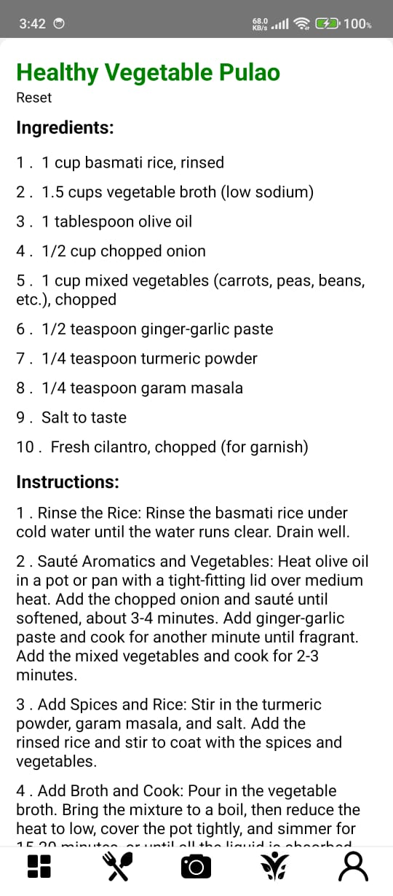
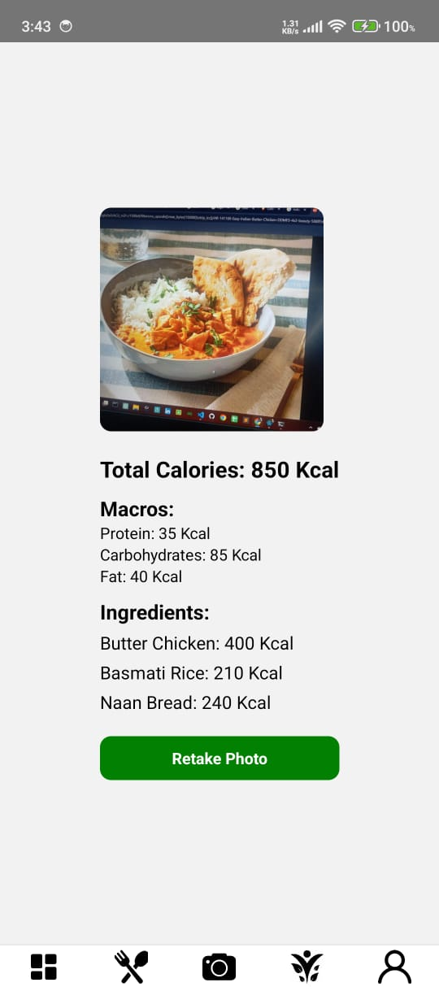
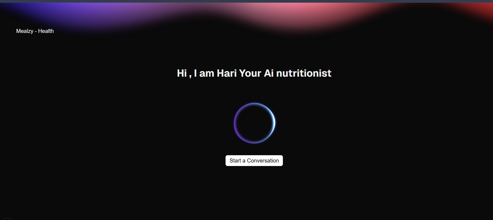

# 🥗 Mealzy Health - AI-Powered Nutrition & Wellness App

**Mealzy Health** is a health and wellness companion powered by AI, designed to help users make smarter food choices, monitor their nutritional intake, and build sustainable habits. With a blend of beautiful UI, real-time insights, and smart AI support (powered by Gemini 2.0 Flash), Mealzy offers a unique experience for anyone focused on improving their lifestyle.

## Demo - ai Nutritionist (Beta)

[Live Mealzi health](https://mealzy-health.vercel.app/)

---

  
  
  

## 🚀 Features

- 🧠 **AI-Powered Calorie Assessment**  
  Instantly assess your food's calorie and nutrition values using AI image recognition and text input.

- 📊 **Advanced Food Intake Statistics**  
  Get a breakdown of your daily, weekly, and monthly food intake. Visualizations show your progress over time.

- 🧑‍🍳 **Healthier Recipe Suggestions**  
  Personalized recipe ideas based on your dietary patterns and wellness goals.

- 🔥 **Streaks & Habit Building**  
  Stay consistent with gamified streaks, daily challenges, and motivational nudges.

- 🧬 **AI-Agent Nutritionist Dashboard**  
  Access a web dashboard powered by Gemini 2.0 Flash to consult with your virtual AI nutritionist for advanced suggestions and feedback.

---

## Agentic Ai powered Nutritionist

## 🛠 Tech Stack

### 📱 Mobile App (React Native)
- `React Native 0.79.1`
- `React Navigation`
- `Vision Camera` for AI food recognition
- `Toast Messages`, `Linear Gradient`, `Charts`, etc.

### 🌐 Backend
- `Node.js`, `Express.js`
- `MongoDB` with `Mongoose`
-  Modular REST APIs

### 🧠 AI & Analytics
- **Gemini 2.0 Flash** for AI calorie/nutrition assessment & personalized insights
-  **OpenAI_4O_Latest** for Conversational AI
- **Vapi** for Agentic-Ai workflow Developement

### 💻 Web Dashboard
- `Next.js` for SSR and performance
- `Tailwind CSS` for clean responsive UI
- Web panel to manage AI Nutritionist interactions

---